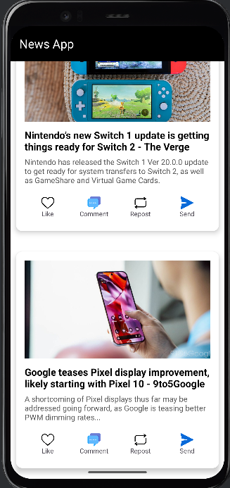
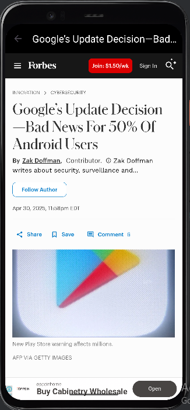

# 📰 Android News App
[](https://github.com/yibeltal-gashaw/Android-News-App/actions/workflows/android.yml)


A simple and modern Android app that fetches and displays the latest news articles using the [NewsAPI](https://newsapi.org/). This app supports category filtering, offline article saving, and in-app reading via WebView.

---

## ✨ Features

- 🔥 Top headlines from global news sources
- 🌐 Open articles within the app using WebView
- 💾 Save articles locally using SQLite
- 🌓 Light/Dark mode
- 🔐 Login & Bookmark (optional)

---

## 📸 Screenshots

| Home Screen                   | Article View                          |
|-------------------------------|---------------------------------------|
|  |  | 

---

## 🚀 Getting Started

### 📦 Prerequisites

- Android Studio Flamingo or higher
- Java or Kotlin support
- Internet connection (for fetching news)
- [NewsAPI Key](https://newsapi.org/)

### 🛠 Installation

1. **Clone the repository**

```bash
git clone https://github.com/yibeltal-gashaw/Android-News-App.git
cd Android-News-App
```

2. **Add your NewsAPI key**

   - Create a `local.properties` file or use `BuildConfig` to securely store your API key.
   - Example usage in `NewsService.kt`:
     ```kotlin
      val API_KEY = "YOUR_NEWSAPI_KEY"
     ```

3. **Build and run the app** on an emulator or physical device.

---

## 🧰 Tech Stack

- **Java**
- **Retrofit** (for API calls)
- **SQLite** (Room)
- **Material Design**
- **Glide** (for image loading)
- **WebView**

---

## 📌 TODOs

- [ ] Add Firebase Authentication
- [ ] 🗂 News by categories (Technology, Sports, Business, etc.)
- [ ] 🔍 Search functionality
- [ ] Implement push notifications
- [ ] Improve UI/UX for tablet layout
- [ ] Add support for pagination and infinite scrolling

---

## 🤝 Contributing

Contributions are welcome! Feel free to open an issue or submit a pull request. Please follow standard [GitHub contributing guidelines](https://docs.github.com/en/get-started/quickstart/contributing-to-projects).

---

## 📄 License

This project is licensed under the MIT License - see the [LICENSE](LICENSE) file for details.

---

## 🙋‍♂️ Author

Made with ❤️ by [Yibeltal Gashaw](https://github.com/yibeltal-gashaw)
